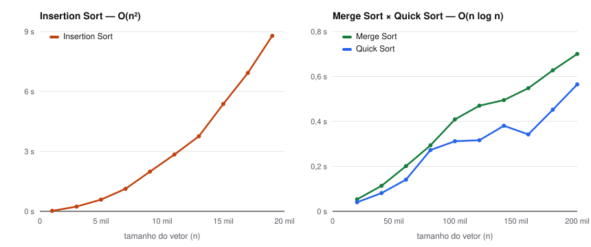

# Algoritmos e Estruturas de Dados I

Soluções e implementações da disciplina de Algoritmos e Estruturas de Dados I — Ciência da
Computação, UNIFESP. Tudo em **C**.

```text
ordenacao/    algoritmos de ordenação, laboratório de desempenho e resultados medidos
estruturas/   estruturas de dados implementadas do zero
beecrowd/     soluções de problemas do juiz online beecrowd
```

## Ordenação

| Algoritmo | Arquivo | Complexidade (caso médio) |
| --- | --- | --- |
| Insertion Sort | [`InsertionSort.c`](ordenacao/InsertionSort.c) | O(n²) |
| Merge Sort | [`MergeSort.c`](ordenacao/MergeSort.c) | O(n log n) |
| Quick Sort | [`QuickSort.c`](ordenacao/QuickSort.c) | O(n log n) |

O [laboratório de ordenação](ordenacao/LaboratorioDeOrdenacao.c) sorteia um vetor do tamanho
pedido e mede com `clock()` o tempo de **Insertion, Selection, Merge, Quick e Heap Sort** sobre
cópias do mesmo vetor. Insertion e Selection só rodam até 10 mil elementos, porque acima disso
ficam lentos demais.

Tempos medidos ([`resultados.csv`](ordenacao/resultados.csv)):



O Insertion Sort passa de 8 s com 19 mil elementos, enquanto Merge e Quick ordenam dez vezes
mais dados em menos de 0,7 s — a diferença entre O(n²) e O(n log n) na prática.

## Estruturas de dados

| Estrutura | Arquivo | Descrição |
| --- | --- | --- |
| Lista encadeada ordenada | [`ListaEncadeadaOrdenada.c`](estruturas/ListaEncadeadaOrdenada.c) | lista com nó cabeça e nós alocados dinamicamente; os itens entram no início e depois são ordenados por nome com bubble sort, trocando o conteúdo dos nós |

## Problemas do beecrowd

43 problemas resolvidos. O número leva ao enunciado no [beecrowd](https://judge.beecrowd.com);
alguns têm mais de uma solução (por exemplo, `1383a.c` e `1383b.c`, a segunda com a matriz
alocada dinamicamente).

| Problema | Técnicas | Solução |
| --- | --- | --- |
| [1000](https://judge.beecrowd.com/pt/problems/view/1000) | — | [`1000.c`](beecrowd/1000.c) |
| [1002](https://judge.beecrowd.com/pt/problems/view/1002) | — | [`1002.c`](beecrowd/1002.c) |
| [1020](https://judge.beecrowd.com/pt/problems/view/1020) | — | [`1020.c`](beecrowd/1020.c) |
| [1022](https://judge.beecrowd.com/pt/problems/view/1022) | — | [`1022.c`](beecrowd/1022.c) |
| [1024](https://judge.beecrowd.com/pt/problems/view/1024) | — | [`1024.c`](beecrowd/1024.c) |
| [1025](https://judge.beecrowd.com/pt/problems/view/1025) | ordenação | [`1025.c`](beecrowd/1025.c) |
| [1062](https://judge.beecrowd.com/pt/problems/view/1062) | pilha | [`1062.c`](beecrowd/1062.c) |
| [1068](https://judge.beecrowd.com/pt/problems/view/1068) | — | [`1068.c`](beecrowd/1068.c) |
| [1069](https://judge.beecrowd.com/pt/problems/view/1069) | — | [`1069.c`](beecrowd/1069.c) |
| [1076](https://judge.beecrowd.com/pt/problems/view/1076) | grafo | [`1076.c`](beecrowd/1076.c) |
| [1077](https://judge.beecrowd.com/pt/problems/view/1077) | pilha | [`1077.c`](beecrowd/1077.c) |
| [1082](https://judge.beecrowd.com/pt/problems/view/1082) | grafo | [`1082.c`](beecrowd/1082.c) |
| [1088](https://judge.beecrowd.com/pt/problems/view/1088) | ordenação | [`1088.c`](beecrowd/1088.c) |
| [1110](https://judge.beecrowd.com/pt/problems/view/1110) | — | [`1110.c`](beecrowd/1110.c) |
| [1148](https://judge.beecrowd.com/pt/problems/view/1148) | grafo · Dijkstra | [`1148.c`](beecrowd/1148.c) · [`1148b.c`](beecrowd/1148b.c) |
| [1152](https://judge.beecrowd.com/pt/problems/view/1152) | árvore geradora mínima | [`1152.c`](beecrowd/1152.c) |
| [1162](https://judge.beecrowd.com/pt/problems/view/1162) | ordenação | [`1162.c`](beecrowd/1162.c) |
| [1194](https://judge.beecrowd.com/pt/problems/view/1194) | árvore | [`1194.c`](beecrowd/1194.c) |
| [1195](https://judge.beecrowd.com/pt/problems/view/1195) | árvore binária de busca | [`1195.c`](beecrowd/1195.c) |
| [1211](https://judge.beecrowd.com/pt/problems/view/1211) | ordenação | [`1211.c`](beecrowd/1211.c) |
| [1215](https://judge.beecrowd.com/pt/problems/view/1215) | ordenação | [`1215.c`](beecrowd/1215.c) |
| [1242](https://judge.beecrowd.com/pt/problems/view/1242) | pilha | [`1242.c`](beecrowd/1242.c) |
| [1244](https://judge.beecrowd.com/pt/problems/view/1244) | ordenação | [`1244.c`](beecrowd/1244.c) |
| [1251](https://judge.beecrowd.com/pt/problems/view/1251) | ordenação | [`1251.c`](beecrowd/1251.c) |
| [1256](https://judge.beecrowd.com/pt/problems/view/1256) | tabela hash | [`1256.c`](beecrowd/1256.c) |
| [1259](https://judge.beecrowd.com/pt/problems/view/1259) | ordenação | [`1259.c`](beecrowd/1259.c) |
| [1281](https://judge.beecrowd.com/pt/problems/view/1281) | — | [`1281.c`](beecrowd/1281.c) |
| [1286](https://judge.beecrowd.com/pt/problems/view/1286) | — | [`1286.c`](beecrowd/1286.c) |
| [1303](https://judge.beecrowd.com/pt/problems/view/1303) | ordenação | [`1303.c`](beecrowd/1303.c) |
| [1310](https://judge.beecrowd.com/pt/problems/view/1310) | — | [`1310.c`](beecrowd/1310.c) |
| [1383](https://judge.beecrowd.com/pt/problems/view/1383) | matriz | [`1383.c`](beecrowd/1383.c) · [`1383a.c`](beecrowd/1383a.c) · [`1383b.c`](beecrowd/1383b.c) |
| [1430](https://judge.beecrowd.com/pt/problems/view/1430) | — | [`1430.c`](beecrowd/1430.c) |
| [1466](https://judge.beecrowd.com/pt/problems/view/1466) | árvore · fila | [`1466.c`](beecrowd/1466.c) |
| [1548](https://judge.beecrowd.com/pt/problems/view/1548) | ordenação | [`1548.c`](beecrowd/1548.c) |
| [1566](https://judge.beecrowd.com/pt/problems/view/1566) | ordenação | [`1566InsertionSort.c`](beecrowd/1566InsertionSort.c) · [`1566SelectionSort.c`](beecrowd/1566SelectionSort.c) |
| [1610](https://judge.beecrowd.com/pt/problems/view/1610) | grafo | [`1610.c`](beecrowd/1610.c) |
| [1774](https://judge.beecrowd.com/pt/problems/view/1774) | árvore geradora mínima | [`1774.c`](beecrowd/1774.c) |
| [1930](https://judge.beecrowd.com/pt/problems/view/1930) | — | [`1930.c`](beecrowd/1930.c) |
| [2006](https://judge.beecrowd.com/pt/problems/view/2006) | — | [`2006.c`](beecrowd/2006.c) |
| [2381](https://judge.beecrowd.com/pt/problems/view/2381) | ordenação | [`2381.c`](beecrowd/2381.c) |
| [2413](https://judge.beecrowd.com/pt/problems/view/2413) | — | [`2413.c`](beecrowd/2413.c) |
| [2729](https://judge.beecrowd.com/pt/problems/view/2729) | ordenação | [`2729.c`](beecrowd/2729.c) |
| [3160](https://judge.beecrowd.com/pt/problems/view/3160) | — | [`3160.c`](beecrowd/3160.c) |

## Como compilar

Com GCC:

```bash
gcc ordenacao/LaboratorioDeOrdenacao.c -o laboratorio
./laboratorio
```

Qualquer arquivo compila da mesma forma: `gcc caminho/arquivo.c -o programa`.
